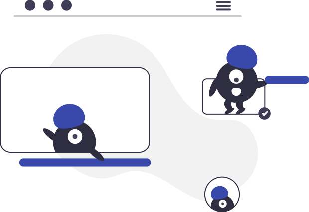

<h3 align="center"></img></h3>

  

<h3 align="center"></img> </img> </img></h3>

Created to help developers build high-quality digital experiences for web and mobile.

<h2><a href="#features">Features</a></h2>

- [x] Font size
- [x] Font family
- [x] Font weight
- [x] Line height
- [x] Font variant
- [x] Opacity
- [x] Shadows
- [x] Z-Index
- [x] Colors
- [x] Theme
- [x] Theme colors
- [x] React hook use theme colors
- [x] React native theme provider

# Author

